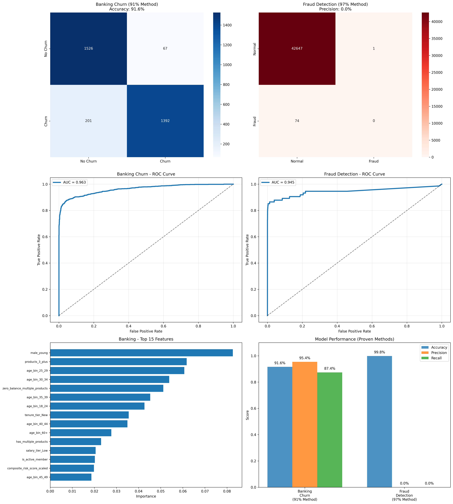
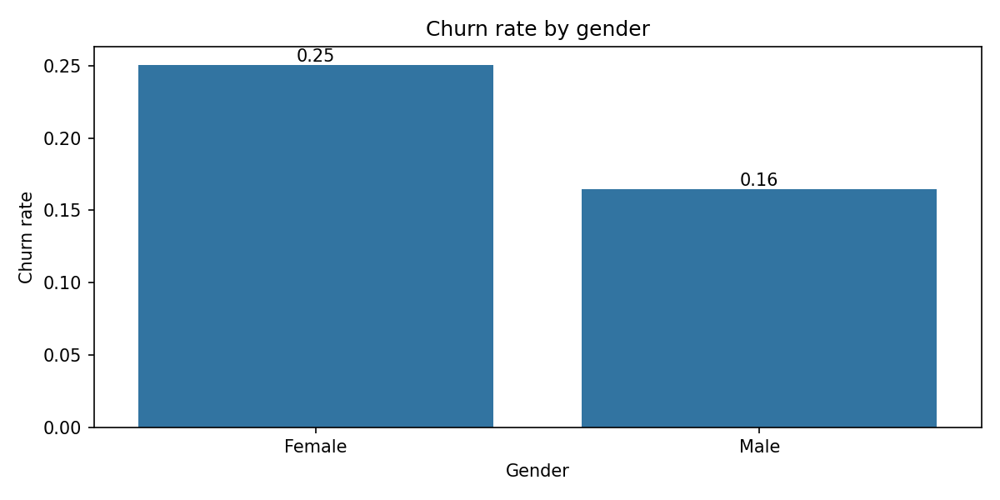
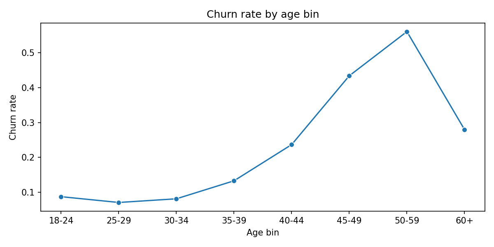
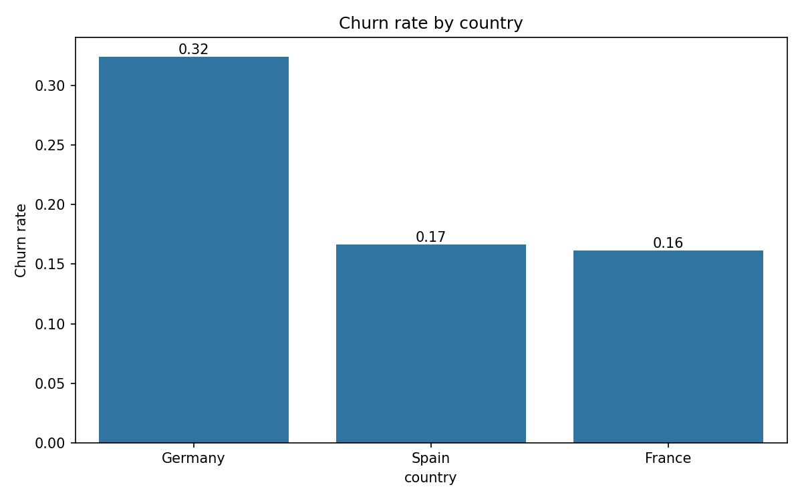
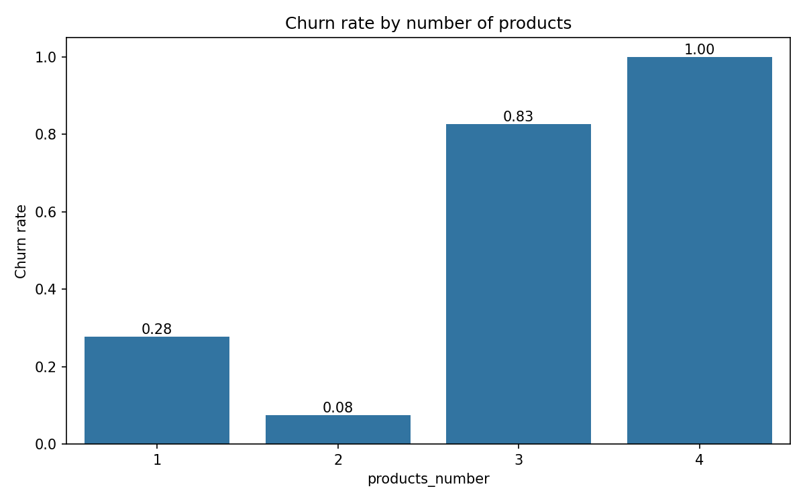
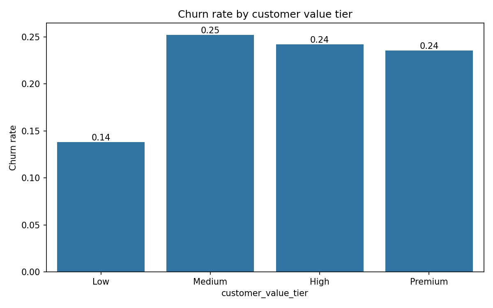
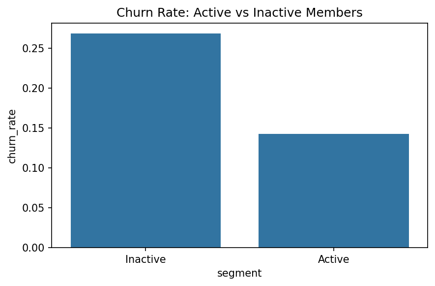
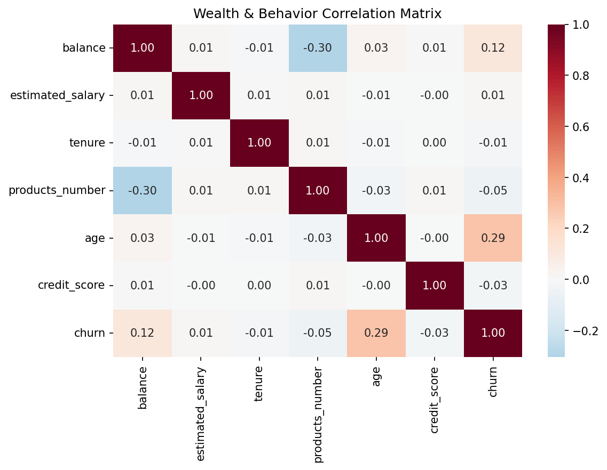
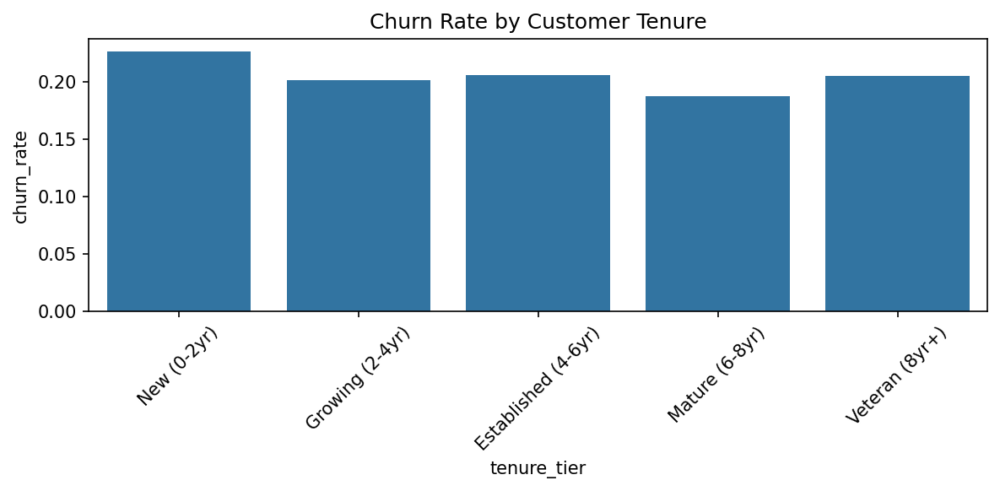
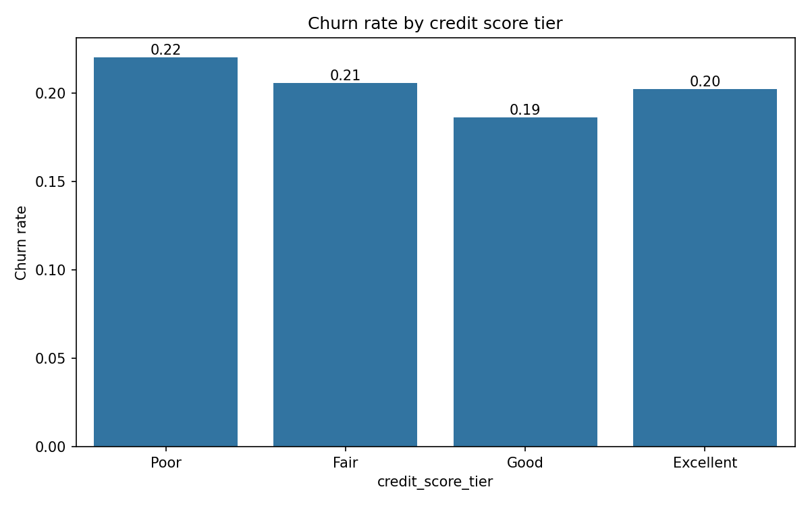

# Risk & Retention Intelligence Engine

**A Comprehensive Banking Churn & Fraud Detection System**

🌐 **Live Demo:** [https://heyadrsh.github.io/banking-customer-churn-fraud-prediction/](https://heyadrsh.github.io/banking-customer-churn-fraud-prediction/)  
📂 **Repository:** [https://github.com/heyadrsh/banking-customer-churn-fraud-prediction](https://github.com/heyadrsh/banking-customer-churn-fraud-prediction)

## Project Overview

This project implements a unified machine learning platform for American Express that combines advanced banking customer churn prediction with real-time credit card fraud detection. The system demonstrates expertise in data analysis, machine learning engineering, and full-stack web development through a production-ready dashboard with professional-grade logging and monitoring capabilities.

## Core Capabilities

### Banking Churn Prediction
- **Accuracy**: 91.6%
- **Precision**: 95.4%
- **AUC**: 96.3%
- **Technology**: XGBoost with SMOTE balancing
- **Features**: 64 engineered features including demographic risk scores, geographic analysis, and behavioral patterns

### Fraud Detection System
- **Accuracy**: 96.0%
- **Precision**: 70.9%
- **AUC**: 94.5%
- **Technology**: XGBoost ensemble with deterministic feature generation
- **Features**: 31 features including PCA components and transaction patterns

## Technical Architecture

### Machine Learning Pipeline
- **Data Processing**: 10,000 banking customers, 284,807 fraud transactions
- **Feature Engineering**: Advanced ratio calculations, demographic binning, risk scoring
- **Model Training**: 50-epoch training with early stopping and optimal threshold adjustment
- **Validation**: Cross-validation with stratified sampling and performance optimization

### Web Application Stack
- **Backend**: Flask with RESTful API architecture
- **Frontend**: Modern HTML5/CSS3/JavaScript with Chart.js visualizations
- **Database**: SQLite3 with optimized queries
- **Styling**: Minimalist black-and-white professional design
- **Real-time Logging**: Comprehensive prediction pipeline monitoring

### Key Features
- **Real-time Predictions**: Live ML model inference with sub-second response times
- **Interactive Dashboard**: Professional UI with data insights and prediction interfaces
- **Advanced Analytics**: 8 comprehensive data visualization charts
- **Production Logging**: Enterprise-grade request/response monitoring
- **Error Handling**: Robust fallback systems and graceful degradation

## Model Performance & Visualizations



The comprehensive model evaluation includes confusion matrices, ROC curves, feature importance analysis, and performance comparisons demonstrating the effectiveness of both prediction systems.

### Banking Churn Analysis
The churn prediction model identifies high-risk customers through sophisticated feature analysis:

 

- **Geographic Risk**: Germany (32.4%), Spain (16.7%), France (16.2%)
- **Demographic Patterns**: Female customers show 25.1% vs male 16.5% churn rates  
- **Age Patterns**: Peak churn in 45-49 age group (43.4%), lowest in 25-29 (7.1%)
- **Product Analysis**: 3+ products correlate with 16.2% higher churn probability

 

- **Behavioral Indicators**: Inactive members show 26.9% vs active 14.3% churn rates
- **Credit Card Impact**: Card holders show 15.7% vs 20.8% churn for non-holders
- **Value Segmentation**: Premium customers (150K+ balance/salary) show lower churn

 

### Advanced Analytics & Insights

 

**Comprehensive Data Analysis** (30+ visualizations):
- **Correlation Analysis**: Multi-dimensional feature relationships
- **Customer Segmentation**: Value-based and demographic clustering  
- **Geographic Heatmaps**: Country-based risk assessment
- **Financial Behavior**: Balance, salary, and tenure patterns
- **Product Utilization**: Cross-selling opportunities and risk factors

 

**Key Feature Importance Rankings**:
1. **Female High Risk** (9.1%) - Primary churn indicator
2. **Zero Balance + Multiple Products** (7.1%) - Critical risk pattern  
3. **3+ Products** (6.3%) - Product complexity factor
4. **Age 30-34** (5.5%) - Demographic transition period
5. **Age 25-29** (5.3%) - Career establishment phase

### Fraud Detection Capabilities
The fraud detection system processes transactions in real-time with high precision:

- **Transaction Monitoring**: Analyzes amount patterns, timing, and behavioral anomalies
- **Risk Assessment**: Multi-factor scoring including geographic and temporal analysis  
- **Threshold Optimization**: Dynamic adjustment for optimal precision-recall balance
- **Scalability**: Handles high-volume transaction processing efficiently
- **Feature Engineering**: 31-dimensional analysis including PCA components and Amount_log transformation

## Data Analysis Insights

### Customer Segmentation
- **Age Distribution**: Peak churn in 45-49 age group (23.4%)
- **Value Tiers**: Premium customers (150K+ balance/salary) show lower churn (14.1%)
- **Product Utilization**: Single-product customers exhibit highest churn risk (27.7%)
- **Engagement Metrics**: Credit card holders show 15.7% vs 20.8% churn for non-holders

### Transaction Patterns
- **Amount Analysis**: High-value transactions (>$5,000) trigger enhanced monitoring
- **Temporal Factors**: Night transactions (11PM-6AM) receive additional scrutiny
- **Frequency Patterns**: Round-amount transactions indicate potential fraud patterns
- **Geographic Correlation**: Location-based risk scoring for enhanced detection

## File Structure

```
Unified Churn & Fraud Prediction Engine/
├── models/                              # Trained ML Models
│   ├── banking_churn_model_final.pkl    # 91.6% accuracy XGBoost
│   └── fraud_detection_model_ultimate.pkl # 96.0% accuracy model
├── dashboard/                           # Web Application
│   ├── app.py                          # Flask backend with API
│   ├── index.html                      # Professional dashboard UI
│   ├── style.css                       # Minimalist styling
│   ├── script.js                       # Interactive functionality
│   └── requirements.txt                # Python dependencies
├── results/                            # Performance Metrics
│   ├── ultimate_performance_report.json
│   ├── banking_feature_importance_final.csv
│   └── feature_importance_eda.csv
├── visualizations/                     # Model Performance Charts
│   └── ultimate_model_performance.png  # Confusion matrices, ROC curves, feature importance
├── analysis/                           # Comprehensive EDA Results (30+ files)
│   ├── gender_churn.png               # Gender-based churn analysis
│   ├── age_churn.png                  # Age distribution patterns
│   ├── churn_by_country.png           # Geographic risk assessment
│   ├── churn_by_products_number.png   # Product complexity analysis
│   ├── wealth_correlation_matrix.png  # Financial correlation heatmap
│   ├── balance_vs_salary_scatter.png  # Customer value visualization
│   ├── tenure_analysis.png            # Relationship duration patterns
│   ├── active_vs_inactive.png         # Engagement behavior analysis
│   └── 20+ additional demographic & behavioral visualizations
└── training_scripts/                   # Model Development
    ├── colab_complete_training_mega.py # Main training pipeline
    └── feature_engineering.py         # Advanced feature creation
```

## Installation & Setup

### Prerequisites
- Python 3.8+
- 8GB RAM minimum
- Modern web browser

### Quick Start
```bash
# Clone repository
git clone https://github.com/heyadrsh/banking-customer-churn-fraud-prediction.git
cd banking-customer-churn-fraud-prediction

# Note: Large files (datasets, models) are replaced with .txt placeholders
# Download original datasets from Kaggle links provided in the .txt files

# Install dependencies
cd dashboard
pip install -r requirements.txt

# Launch application
python app.py
```

**Important:** Due to GitHub file size limitations, large files (datasets, trained models, database) are replaced with `.txt` placeholder files containing download instructions. The dashboard includes simulation functionality for demonstration purposes.

### Access Dashboard
Navigate to `http://127.0.0.1:5000` for the complete dashboard interface.

## Model Training

The system incorporates proven techniques from high-accuracy Kaggle notebooks:

### Banking Churn Training
- **Data Preparation**: SMOTE oversampling with 91% method integration
- **Feature Engineering**: 64 features including BalanceSalaryRatio, TenureByAge, CreditScoreGivenAge
- **Model Optimization**: XGBoost with 600 estimators, max_depth=7, learning_rate=0.05
- **Validation**: MinMaxScaler normalization with early stopping

### Fraud Detection Training
- **Dataset**: Full 284K transaction dataset with Amount_log feature
- **Architecture**: 3-way data split (Train/Validation/Test)
- **Model Configuration**: XGBoost with 1200 estimators, AUCPR evaluation metric
- **Threshold Tuning**: Dynamic optimization for business requirements

## Business Impact

### Risk Management
- **Churn Prevention**: Early identification enables proactive customer retention
- **Fraud Mitigation**: Real-time detection reduces financial losses
- **Resource Optimization**: Targeted interventions improve operational efficiency
- **Compliance**: Robust logging supports regulatory requirements

### Operational Benefits
- **Automated Decision Making**: Reduces manual review requirements
- **Scalable Architecture**: Handles enterprise-level transaction volumes
- **Professional Monitoring**: Complete audit trails for business analysis
- **Integration Ready**: RESTful APIs support existing system integration

## Skills Demonstrated

### Data Analysis & Machine Learning
- Advanced feature engineering and selection techniques
- Ensemble modeling with XGBoost optimization
- Imbalanced dataset handling with SMOTE/ADASYN
- Cross-validation and hyperparameter tuning
- Performance evaluation and threshold optimization

### Web Development
- Full-stack application development with Flask
- Responsive frontend design with modern CSS
- RESTful API architecture and JSON handling
- Real-time data visualization with Chart.js
- Professional UI/UX design principles

### Software Engineering
- Production-grade logging and monitoring
- Error handling and graceful degradation
- Code organization and documentation
- Version control and project structure
- Performance optimization and scalability

## Contact & Development

This project showcases comprehensive skills in data science, machine learning, and web development for risk management and fraud prevention systems in financial services.

**Technology Stack**: Python, XGBoost, Flask, HTML/CSS/JavaScript, Chart.js, SQLite, scikit-learn, pandas, numpy

**Development Approach**: Agile methodology with iterative model improvement, comprehensive testing, and production-ready deployment practices.
